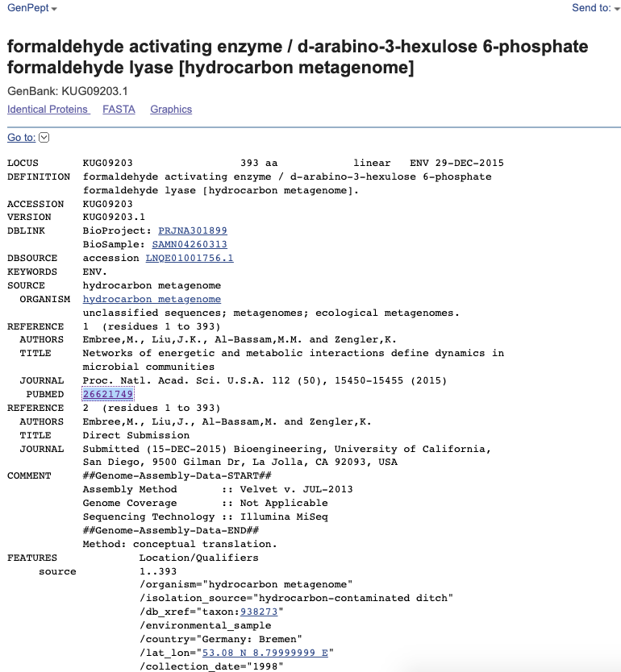
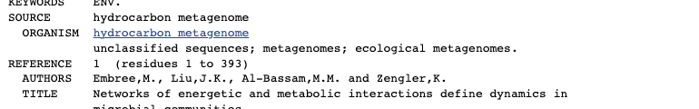
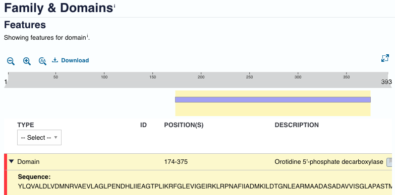
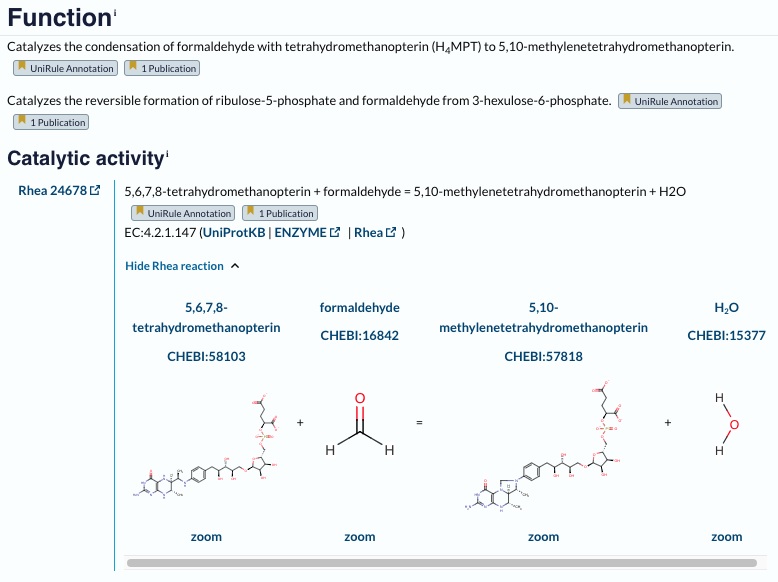
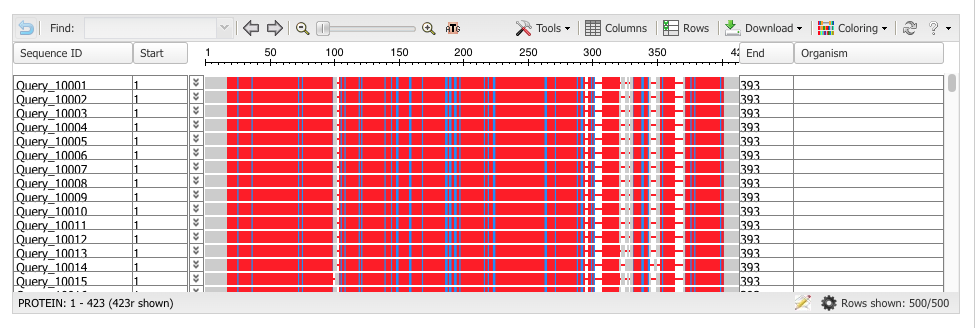
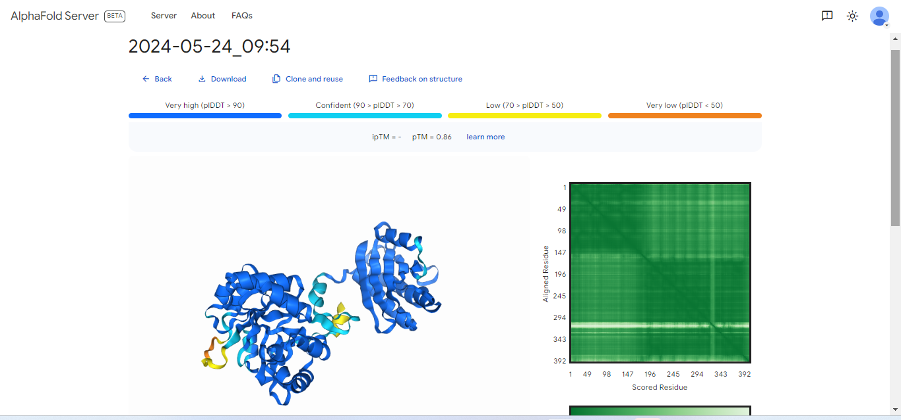
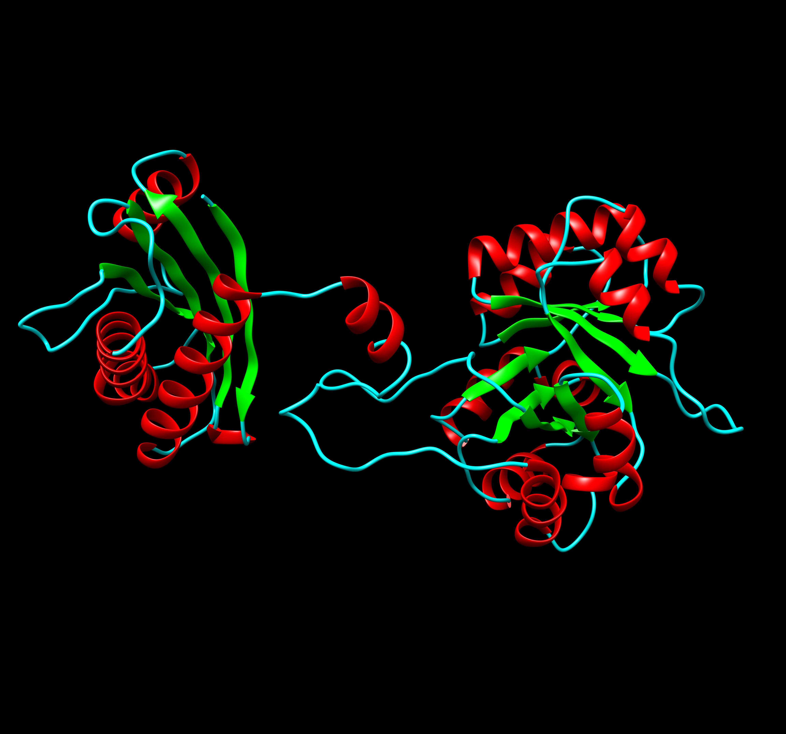

# Predloga

# S43

- **Avtor**: Lara Pajnhart
- **Datum izdelave**: 2024-05-17
- **Koda seminarja**: S43
---
## Vhodni podatek

Povezava do datoteke z vhodnim podatkom: [S43](naloge/s43-input.md)

---
## Rezultati analiz

Samo iskanje proteina je potekalo tako, da sem poiskala aminokislinsko zaporedje plazmida iz katerega smo izvzeli del proteina in naredila med vhodnim podatkom in zaporedjem plazmida poravnavo s pomočjo EMBOSS Water poravnave. Tisti del, ki se ni poravnal sem prilepila v Blast in iskala po blastx (iz nukleotidnega zaporedja v protein). Tako sem dobila zadetek za protein, ki je naveden spodaj in dobila tudi 100% ujemanje ter zelo majhno E vrednost. Nato pa je sledilo iskanje proteina v Genbanku, kjer sem iz dobljenih rezultatov lahko razbrala dolžino proteina. Za protein ni bila klasificirana njegova lokalizacija, sem pa poiskala njemu soroden protein (protein s podobno funkcijo) in se je le-ta nahajal v citoplazmi celice. Za velikost proteina je bilo mogoče razbrazi že iz GenBanka in sicer dolžina samega zaporedja ter na PDB-ju. Ostala orodja, ki sem jih pri raziskavi še uporabljala so Uniprot, Blast, malenkost PubMed (iskala sem članke v povezavi s proteinom, ker me je zanimalo ali bi v člankih bil klasificiran njegov izvor), Clustal Omega, Phylo.io, pomagala pa sem si tudi s stranjo "Biokemijska informatika". 

### *Ime in izvorni organizem proteina*:
Formaldehyde activating enzyme / d-arabino-3-hexulose6-phosphate formaldehyde lyase, gre za metagenom (ni točno klasificiran organizem). Za podoben protein pa se le-ta nahaja v E.Coli(bakterijskih organizmih). Izvoren protein se nahaja v GenBanku na [povezavi](https://www.ncbi.nlm.nih.gov/protein/KUG09203.1). Tudi na Uniprotu na [povezavi](https://www.uniprot.org/uniprotkb/A0A2U1S6C6/entry).
 

### *Lokalizacija,topologija*:
Ecological metagenomes. V GenBanku sem šla pod razdelek "Organism" in pogledala pod kaj se ta protein uvršča. Ni bilo točnega podatka o izvoru tega proteina, razen "Metagenome". Sem pa našča sorodne proteine s podobno funkcijo, ki pa izhajajo iz E.Coli.

### *Velikost proteina*: 
393aa. Razbrala sem jo iz GenBanku, dolžina je priložena na fotografiji. 

### *Domenska zgradba*: 
Ima 2 domeni (173-375) aminokislin. Domene so zelo lepo razvidne iz strukture proteina, ki sem jo dodala iz Chimere. [Povezava](https://www.uniprot.org/uniprotkb/A0A2U1S6C6/entry).

### *Posttranslacijske modifikacije*: 
Nima posttranslacijskih modifikacij. To sem poiskala na Uniprotu, kjer sem sla pod razdelek PTM/Processing in ni bilo zapisanih nobenih posttranslacijskih modifikacij. Na sliki, kjer je navedeni "TYPE" ni bilo drugega za ibrati kot pa "Chain", zato sem bila prepričana da je ta protein brez PTM. 

### *Funkcija proteina*: 
Katalizira kondenzacijo ribuloza 5-fosfata s formaldehidom, da nastane 3-heksuloza 6-fosfat, substrat je Mg2+ ion. Funkcijo sem poiskala na Uniprotu, lahko pa bi odprla tudi PDB in tam pogledala funkcijo od proteina.

### *Sorodni proteini,poravnava,filogenetsko drevo*:
 Bifunctional enzyme Fae/Hps je njegov sorodni protein. Za filogenetsko drevo pa sem najprej izbrala nekaj sorodnih prokariontov in evkariontov ter jih označila v Uniprotu in jih dala v košarico. Nato sem kliknila download in jih prenesla v non-compressed obliki.To datoteko sem nato naložila v Clustal Omega v "multiple sequence alignment" in izvedla poravnavo. Pod zadetki sem posikala filogenetic tree in tisto prekopirala in vstavila v program phylo.io in dobila izris iz katerih prednikov so posamezni organizmi.

### *Najbolj in najmanj ohranjene regije*:
Za ugotovitev ohranjenih in neohranjenih regij sem poravnavo s pomočjo PSI-Blast-a in Clustal Omege. Zaporedje mojega proteina sem dala v PSI-Blast in ga nato zagnala ter ga RUN-ala 3x. Nato sem označila 500 organizmov, ki sem jih dobila kot zadetke in jih prenesla v datoteko. To datoteko sem nato prenesla v Clustal Omego in zagnala poravnave med temi zaporedji. Tako sem dobila poravnave prikazane na sliki spodaj. Iz rezultatov je bilo razvidno, da ima protein v veliki večini ohranjene regije (to so rdeče obravana polja), zelo malo pa je neohranjenih regij (modra barva). 

### *Aminokislinsko zaporedje proteina*
MYVIGEALVGDGPELAHIDLVIGEKEGPVGTAFANALSQLSTGHTPLLAVVRPNLLTKPATLVIPKVTLKKDAQIREMFGPVQAAVAKAIADCVEEEVFGDCDIESLVILASVYLNPEAADYNRIYRYNYGAVKLAVRRAMEGFPDQKTLLYEKDRSTHAIMGFRVQRLWDPPYLQVALDLVDMNRVAEVLAGLPENDHLIIEAGTPLIKRFGLEVIGEIRKLRPNAFIIADMKILDTGNLEARMAADASADAVVISGLAPASTMEKAIAEAKKTGIYSIVDMLNVNDPVKVIKGLKVKPDIVELHRAIDADDTAHAWGDIPALKKAAGGKLIVATAGGIRVDVVRDAVRAGADIIVVGRAITASKDVHTAADLFLEQLNREEIDQFRIMTDF

### *Slika iz Alphafold-a*
Zaporedje iz GenBanka sem prenesla v FASTA zaporedju in ga prekorpirala v server AlphaFold. Tako sem dobila izrisano strukturo, prikazano spodaj. Nato sem datoteko prenesla in unzippala ter odprla datoteko cif v programu Chimera, da sem lahko še v Chimeri izrisala tak protein.

### *Slika iz Chimere*:
Iz strukture proteina je že na prvi pogled jasno razbrati da ga sestavljata 2 domeni. Sestavljen je iz alfa-heliksov (obarvanih z rdečo), zavojev (z modro) in beta plošč (zelena). Protein sem najprej ustvarila v AlphaFoldu in šele nato odprla v Chimeri.

