# S45

- **Avtor**: Spela Puhov
- **Datum izdelave**: 2024-05-17
- **Koda seminarja**: S45

---
## Vhodni podatek

Povezava do datoteke z vhodnim podatkom: [S45](naloge/s45-input.md)

---
# Rezultati analiz

## Ime in izvorni organizem

>Za določitev proteina, ki je zapisan na danem fragmentu, sem najprej poiskala sekvenco vektorja pUC57, v katerega je bil protein vstavljen. Zatem sem naredila poravnavo zaporedij s pomočjo programa Water, saj sem z lokalno poravnavo lahko identificirala vektor. 
>Zatem sem izluščila zapis proteina (neporavnani del) in s pomočjo tblast poiskala zapis proteina, ki je identičen tistemu na vektorju (iskala sem po zbirki 'Metagenomic proteins', saj je bil izhodiščni protein metagenomski, pri tem pa nisem spreminjala nobenih parametrov; tblast sem uporabila, ker sem iskala aminokislinsko zaporedje za dano nukleotidno zaporedje). Rezultat, ki sem ga dobila, se sicer ni 100% ujemal z izhodiščnim zapisom (99.74%, kar pomeni razliko v eni aminokislini), vendar sem  ga vseeno upoštevala, saj je E-vrednost enaka 0 (celoten postopek sem dvakrat ponovila in obakrat sem dobila enak rezultat). 
>Gre torej za L-aspartat oksidazo, ki izhaja iz hidrokarbonskega metagenoma, kot je razvidno iz zapisa na GenBanku (razdelka 'DEFINITION' in 'ORGANISM'). 

## Lokalizacija in topologija

> Za določitev lokalizacije in topologije sem najprej poiskala sorodne proteina s pomočjo blastp, saj mojega izhodiščnega proteina ni bilo v UniProtu (iskala sem po zbirki UniProtKB/Swiss-Prot, saj je ta redundančna in vsebuje anotirane zapise, med organizmi 'Bacteria'; blastp sem uporabila, ker sem iskala podobna aminokislinska zaporedja danemu aminokislinskemu zaporedju, ki sem ga pridobila iz zapisa na GenBanku pod razdelkom 'Protein'). Zaradi sorodnosti sem privzela, da imata oba proteina podobne lastnosti (podobno aminokislinsko zaporedje pomeni podobno funkcijo). Rezultat z najnižjo E-vrednostjo in najvišjim odstotkom identičnosti je bila L-aspartat oksidaza, izolirana iz E. coli. 
> Zatem sem ta protein poiskala na UniProtu, kjer je napisano, da se protein nahaja v citoplazmi, za kar sem privzela, da velja tudi za izolirani protein (razdelek 'Subcellular Location'). Gre ne gre za membranski protein, mu topologije nisem določila. 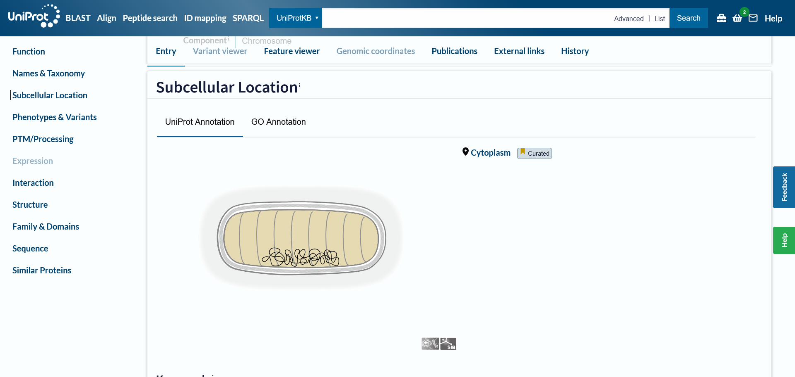

## Velikost proteina

>Velikost izoliranega proteina sem določila s pomočjo zapisa L-aspartat oksidaze na GenBanku, kjer je zapisano, da ga sestavlja 546 aminokislinskih ostankov (v prvi vrstici, kjer je zapisano 546 aa). 

## Domenska zgradba

>Domene, ki gradijo moj izhodiščni protein, sem določila s pomočjo programa InterPro (v program sem vstavila aminokislinsko zaporedje na GenBanku). Kot rezultat sem dobila dve domeni, in sicer FAD vezavno domeno ter domeno fumarat reduktaza/sukcinat dehidrogenaza podobna flavoproteinu oziroma fumarat dehidrogenaza flavoprotein na C-koncu (domeni sta barvno označeno pod razdelkom 'Domain'). 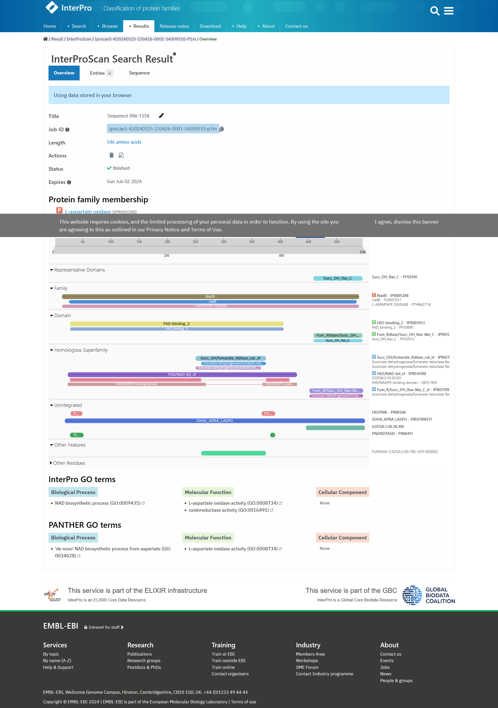

## Post-translacijske modifikacije

> Glede na soroden protein E. coli, ki ima anotiran zapis v UniProtu, sem določila, ali bi lahko imel izolirani protein post-translacijske modifikacije (izhodiščni protein namreč nima zapisa na Uniprotu, zaradi sorodnosti pa lahko sklepamo na podobne lastnosti). Iz anotiranega zapisa lahko sklepamo (razdelek 'PTM/Processing'), da tudi izhodiščni protein nima nobene post-translacijske modifikacije. 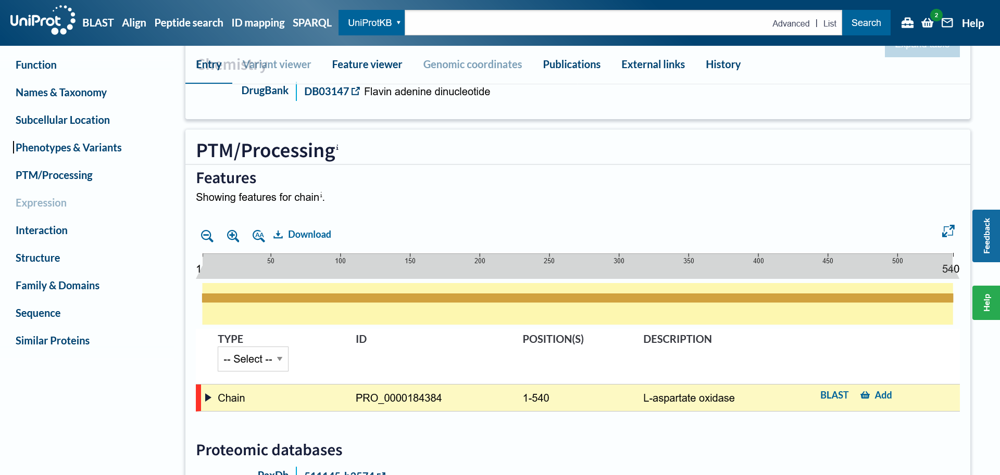

## Funkcija proteina

>Enako kot zgoraj, sem funkcijo določila s pomočjo anotiranega proteina iz E. coli v UniProtu, saj izhodiščni protein nima zapisa v tej zbirki. Zaradi sorodnosti sem privzela, da imata oba enako funkcijo, in sicer v celici katalizirata oksidacijo L-aspartata v iminoaspartat. Gre za prvo stopnjo v de novo sintezi koencima NAD+ (razdelek 'Function'). 

### Substrat

>Ker naj bi izolirani protein predstavljal encim, sem mu s pomočjo anotiranega proteina v UniProtu določila tudi substrat. Protein katalizira reakcijo, v katero vstopata kisik ali fumarat in L-aspartat, pri tem pa potrebuje kofaktor FAD, kot je razvidno v razdelku 'Function'. 

## Sorodni proteini

>Pri iskanju podobnih proteinov sem uporabila psi-blast (primeren za iskanje homologov; naredila sem tri iteracije brez spremenjenih parametrov, v nasprotnem bi namreč dobila preveč rezultatov), iskala pa sem po zbirki UniProtKB/Swiss-Prot, saj ta vsebuje anotirane proteine in je redundančna, med organizmi 'Bacteria'. 
>Zatem z zadetki naredila poravnavo več zaporedij s programom COBALT ter si v tem programu ogledala tudi filogenetsko drevo. Iz njega je razvidno, da je izhodiščni protein v bližnjem sorodstvu s tistim v beta-proteobakterijah (vijolično obarvane povezave), kar je smiselno, saj E. coli uvrščamo med gama-proteobaktrije, ki so sorodne le-tem. 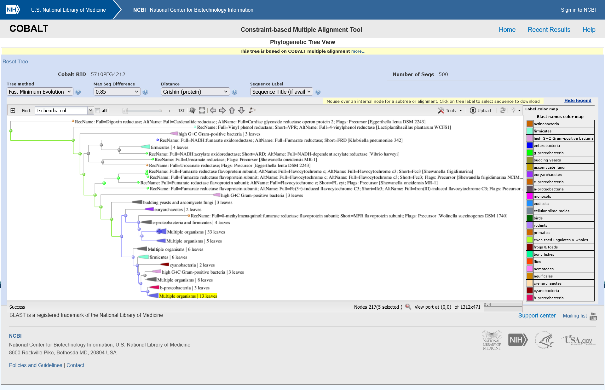

## Najbolj in najmanj ohranjene regije

>Dobljene sorodne proteine s programom psi-blast (pri tem sem uporabila redundančno zbirko anotiranih proteinov UniProtKB/Swiss-Prot, kot organizem pa sem izbrala 'Bacteria') sem poravnala s pomočjo programa COBALT, s katerim sem lahko dobila jasen grafični prikaz ohranjenih in neohranjenih regij. Najbolj ohranjene regije zajemajo vezavna mesta za substrat in aktivno mesto, kar je logično, saj proteini opravljajo enako funkcijo, zato morajo biti aminokislinski ostanki, odgovorni za katalizo, ohranjeni (sivo obarvane z navpičnimi modrimi in rdečimi črtami). Najmanj ohranjene regije so na N-koncu in C-koncu ter vmesne regije, saj te niso udeležene pri katalizi in nanje zato ni bil vršen velik evolucijski pritisk (rdeče obarvane). 

## Podobni evkariontski proteini

>Podobne evkariontske proteine sem našla s pomočjo blastp (primeren za iskanje podobnih aminokislinskih zaporedij), kjer sem spet iskala po redundančni zbirki UniProtKB/Swiss-Prot (kot organizem sem izbrala 'Eukaryota'). Prvi zadetek z najnižjo E-vrednostjo in najvišjim odstotkom identičnosti je bila L-aspartat oksidaza iz riža (Oryza sativa subso. japonica). 
>V UniProtu sem poiskala ustrezen zapis in ugotovila, da ima enako funkcijo in kofaktor kot izhodiščni protein. Nahaja se v kloroplastu, glede na izolirani protein pa ima daljšo aminokislinsko zaporedje (645 aminokislinskih ostankov), kar je smiselno, saj so kloroplasti prokariontskega izvora, izhodiščni protein pa je prokariontski. 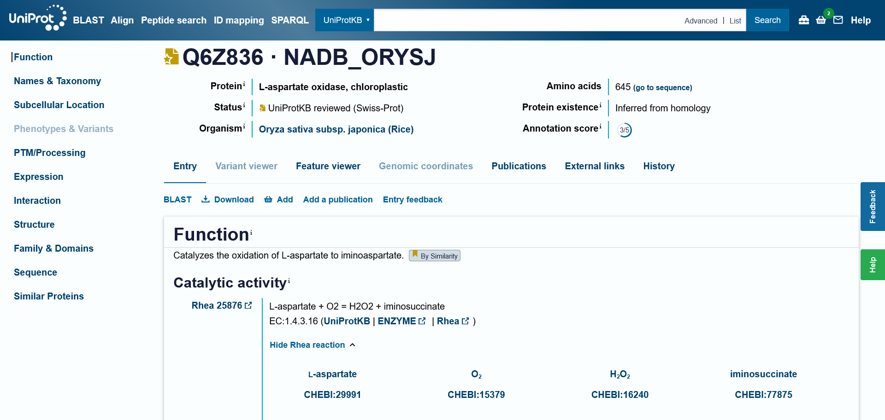 

## Potencialna funkcijska povezanost z drugimi proteini, medproteinske interakcije

>S pomočjo anotiranega proteina E. coli sem v Uniprotu ugotovila, da je tudi izhodiščni protein najverjetneje aktiven v monomerni, lahko pa tudi dimerni obliki, pri čemer tvori homodimer (razdelek 'Interaction'). V medproteinskih zbirkah je zapisano, da protein tvori medproteinske interkacije, in sicer v zbirki IntAct je zabeleženih 7 interaktorjev, v BioGrid pa 13. Večina interaktorjev je v obeh zbirkah enaka, saj gre za encime, udeležene v enaki biosintezni poti. Oboje je zapisano pod razdelkom 'Interaction'.  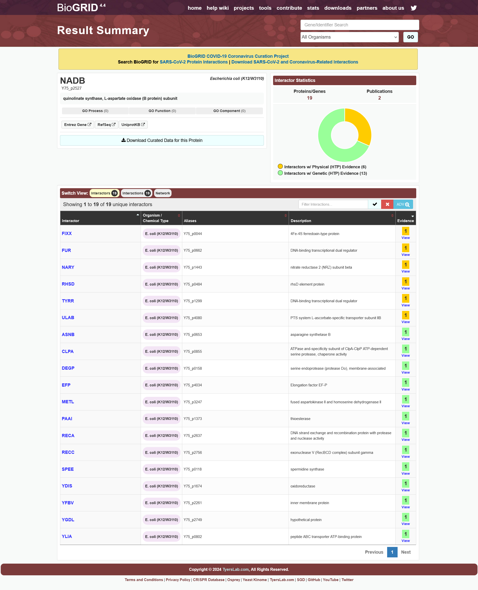 

### Podobni evkariontski proteini

>Pri iskanju medproteinskih interakcij podobnih evkariontskih proteinov sem uporabila prvi zadetek, saj je imel najnižjo E-vrednost in najvišji odstotek identičnosti (uporabila sem program blastp, iskala pa sem po zbirki UniProtKB/Swiss-Prot, saj so v tej zbirki samo anotirani proteini). 
>V Uniprotu sem poiskala ustrezen zapis in si pod razdelkom 'Interaction' ogledala medproteinske interakcije. V zbirki STRING je zapisanih 10 potencialnih interaktorjev, ki niso enaki tistim v E. coli. Sklepamo lahko, da evkariontski protein ni zelo podoben izhodiščnemu, kar je razvidno tudi iz identičnosti poravnave v blastp. 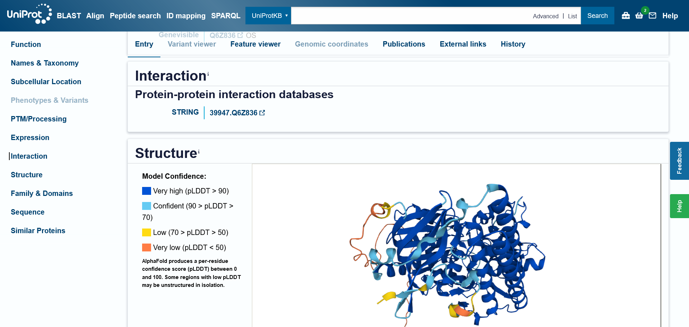 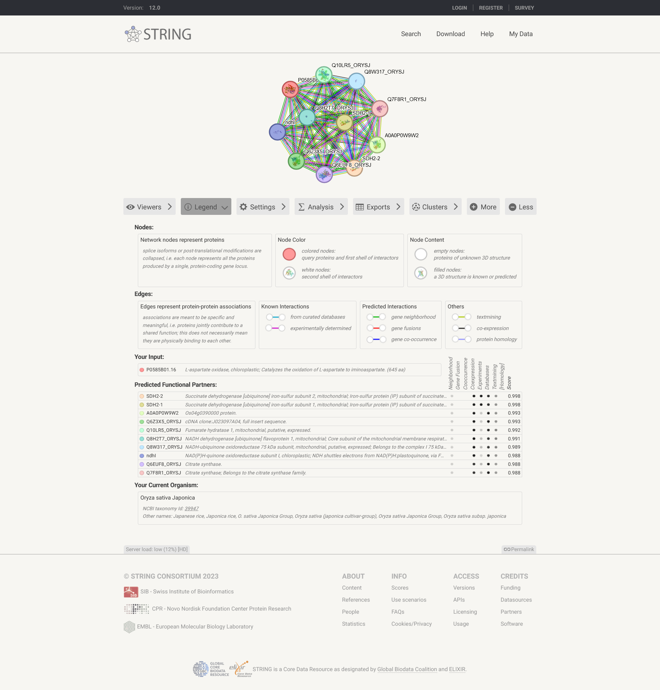

## Struktura 

>S pomočjo programa AlphaFold3 sem narisala model strukture izhodiščnega proteina. Kot je razvidno iz spodnje slike, so najmanj zanesljivo določene regije zanke in C-končna regija (svetlo modra oziroma oranžna barva), kar je smiselno, saj so to najbolj fleksibilne regije in nimajo urejene strukture. 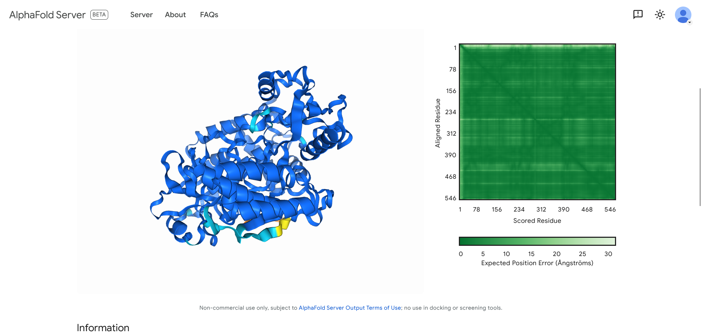

>Ker struktura izhodiščnega proteina ni bila eksperimentalno določena, v programu Molstar nisem mogla narediti superpozicije s prokariontskim oz. evkariontskim proteinom (modela strukture, določenega z AlphaFold3, nisem mogla odpreti v tem programu). V Molstarju sem narisala posamezne strukture prokariontskega oziroma evkariontskega proteina ter jih vizualno primerjala. Izhodiščni protein sem primerjala s prvim zadetkom, ki sem ga dobila pri iskanju z blastp po zbirki UniProtKB/Swiss-Prot med organizmi 'Bacteria' (gre za protein E. coli), saj je imel najvišji odstotek identičnosti in najnižjo E-vrednost. Strukturi sta si navidez zelo podobni, kar je v skladu s tem, da oba proteina opravljata enako funkcijo. Prav tako sta oba proteina prokariontskega izvora, zato je pričakovano podobnost med njima večja kot med evkariontskim in izhodiščnim proteinom. 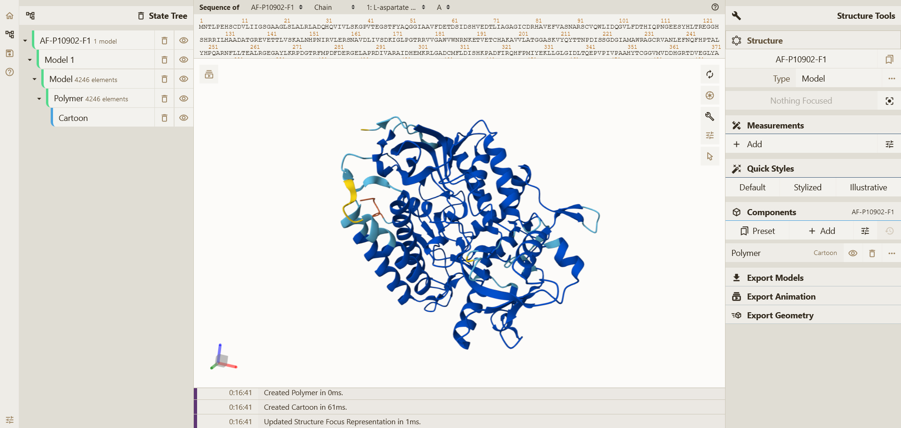
>Za primerjavo z evkariontskim proteinom sem izbrala enak protein kot pri iskanju medproteinskih interakcij podobnih evkariontskih proteinov, saj je imel najnižjo E-vrednost in najvišji odstotek identičnosti. Strukturi sta si podobni, vendar pa evkariontski protein vsebuje daljšo fleksibilno regijo na N-koncu. To je smiselno, saj oba vršita enako funkcijo, vendar izhajata iz zelo različnih organizmov, ki sta doživljala različen evolucijski pritisk, zato se zaporedji veliko bolj razlikujeta med sabo. 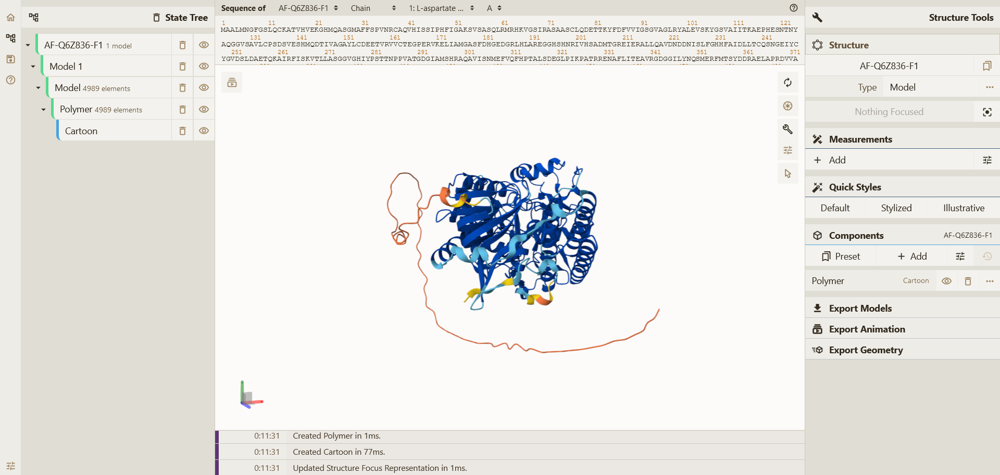
>Naredila sem superpozicijo med sorodnim prokariontskim in evkariontskim proteinom, da sem lahko primerjala strukturi, saj je prokariontski protein zelo podoben izhodiščnemu. V programu Molstar sem prokariontski protein obarvala modro, evkariontski pa sivo. Strukturi sta si zelo podobni, zato lahko sklepamo, da bi enako veljalo, če bi primerjali strukturo izhodiščnega proteina z njima. To je smiselno, saj imajo vsi proteini podobno aminokislinsko zaporedje in opravljajo isto funkcijo. 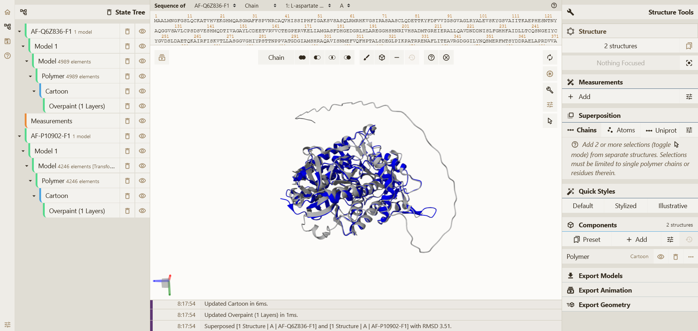
