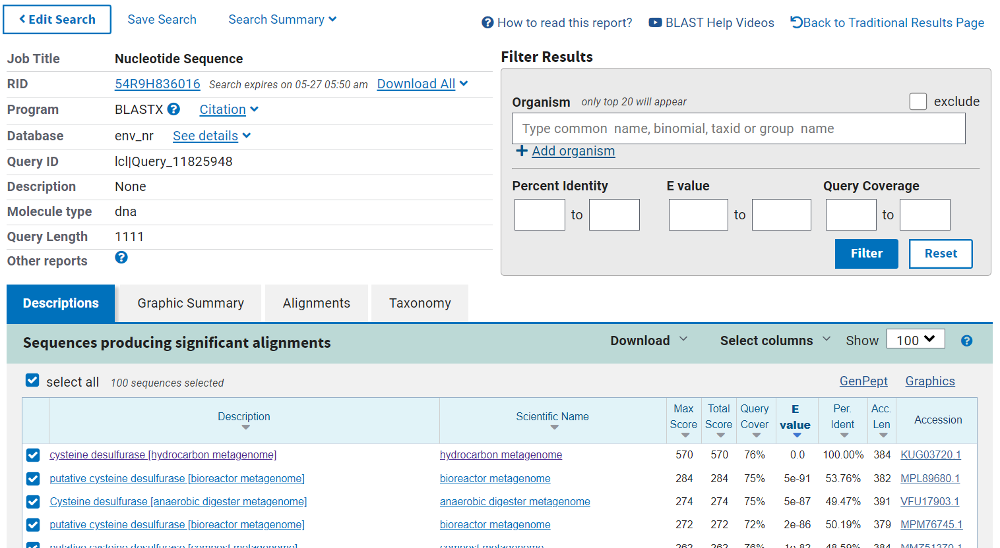
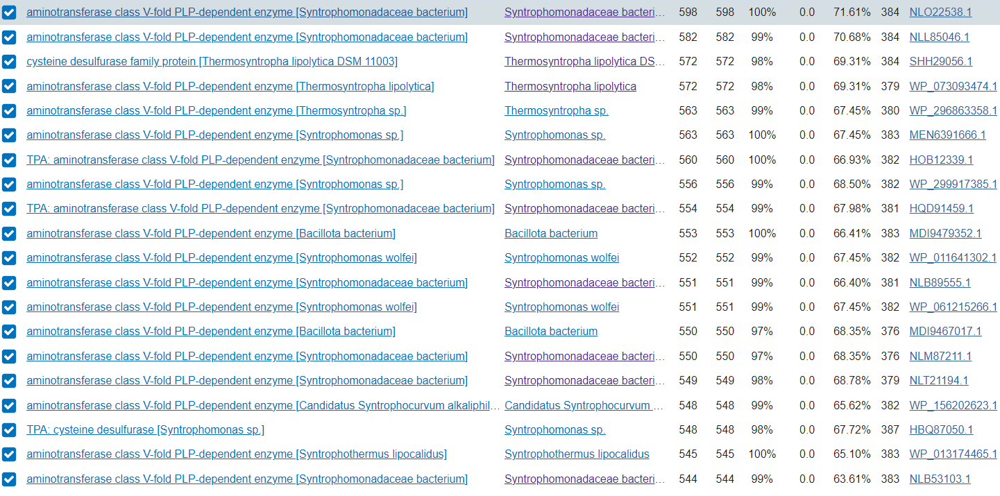
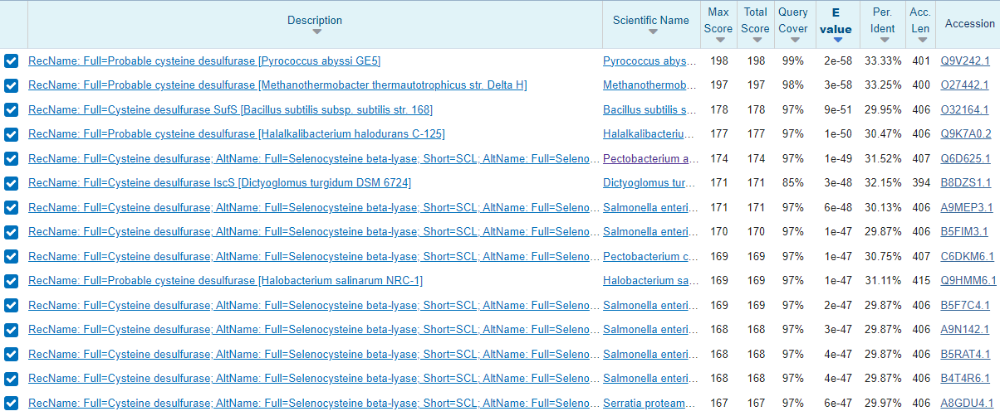
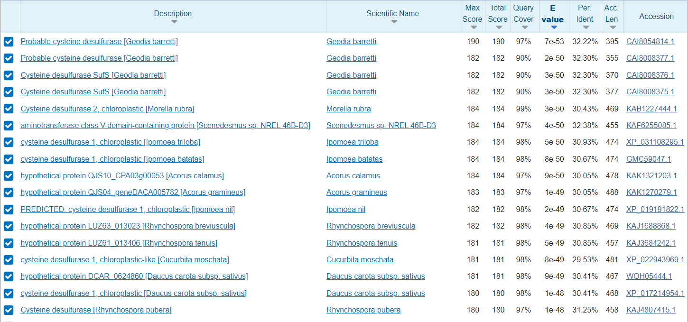
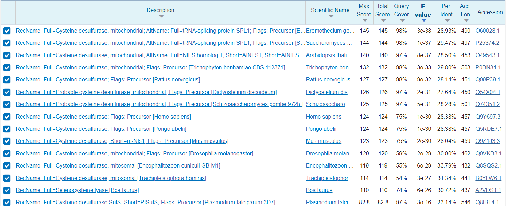
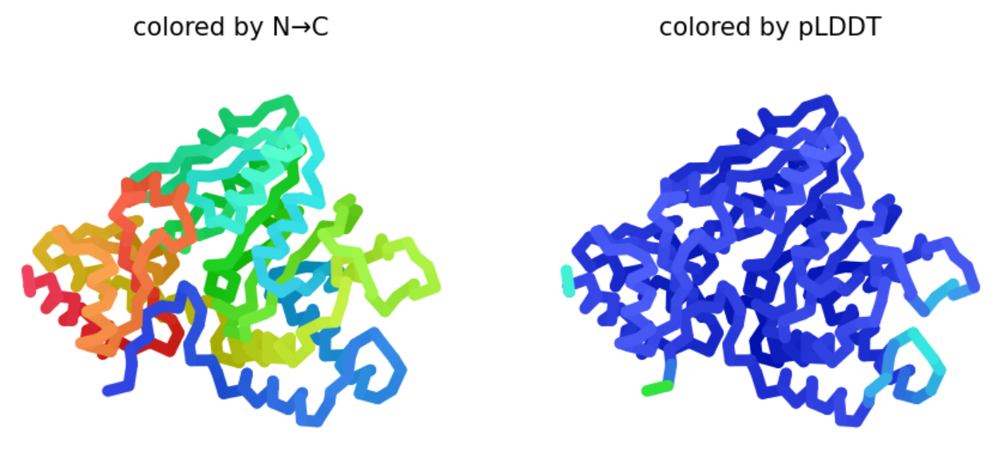
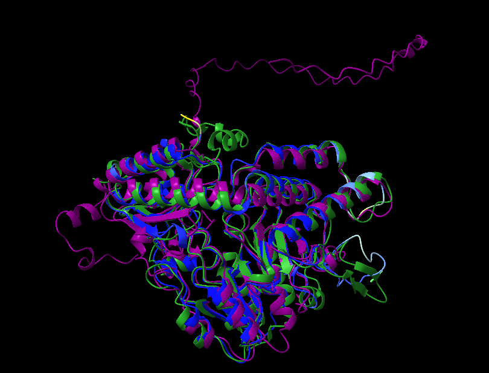

# S47

- **Avtor**: Anja Šakarabot
- **Datum izdelave**: 2024-05-26
- **Koda seminarja**: S47

---
## Vhodni podatek

Povezava do datoteke z vhodnim podatkom: [S47](naloge/s47-input.md)

---
## Rezultati analiz

# 1. Identifikacija proteina

Najprej sem na spletu poiskala prazen plazmid [pUC57](https://www.genscript.com/vector/SD1176-pUC57_plasmid_DNA.html) , ki ustreza našemu plazmidu z insertom. Vhodno zaporedje sem uredila tako, da se je začetek ujemal s praznim plazmidom.

Prazen plazmid in plazmid z insertom sem vstavila v lokalno poravnavo in del dolg 1092 bp (432-1542), ki se ni poravnal s praznim plazmidom predpostavila, da je instert. [Lokalna poravnava vhodnega zporedja in praznega plazmida](https://www.ebi.ac.uk/jdispatcher/psa/emboss_water/summary?jobId=emboss_water-I20240525-222813-0041-4857602-p1m)

Nukleotidno zaporedje inserta sem vstavila v blastx in za database izbrala *Metagenomic proteins*. Iz rezultatov sem razbrala, da se vključek ujema z zapisom za [cistein desulfurazo](https://www.ncbi.nlm.nih.gov/protein/KUG03720.1?report=genbank&log$=prottop&blast_rank=1&RID=54R9H836016).

Naredila sem [globalno poravnavo](https://www.ebi.ac.uk/jdispatcher/psa/emboss_needle/summary?jobId=emboss_needle-I20240525-225951-0405-5610795-p1m) nukleotidnega zaporedja cistein desulfuraze in vključka. Videla sem, da je na 5' koncu vključka zaporedje, ki ne kodira cistein desulfuraze. Na 3' koncu pa vključku manjka 304 bp.

# 2. Osnovni podatki proteina

Cistein desulfuraza se nahaja v UniProt-u pod kodo [A0A0W8E4Y6](https://www.uniprot.org/uniprotkb/A0A0W8E4Y6/entry#sequences). Ker je protein na uniprotu pod *unreviewed* sem z blastp v podatkovni bazi *UniProtKB/Swiss-Prot* poiskala podoben protein, ki je bil bolje anotiran, in sicer cistein desulfuraza iz bakterije *Pectobacterium atrosepticum*. Koda tega proteina na uniprotu je [Q6D625](https://www.uniprot.org/uniprotkb/Q6D625/entry#sequences). Na podlagi tega proteina sem sklepala, da se podatki ujemajo z manjkajočimi pri mojem osnovnem proteinu.

- **Ime**: cistein desulfuraza
- **Izvorni organizem proteina**: ni znan, je iz okoljskega vzorca
- **lokalizacija**: citoplazma
- **Velikost proteina**: 384 ak
- **Domenska zgradba**: aminotransferaza tipa 5 med 4-372 ak ostanki
- **post-translacijske modifikacije**: Na podobnem proteinu je na 226 mestu na lizinskem ak ostanku piridoksalfosfatna skupina
- **funkcija proteina**: katalizira prenos sulfatne skupine, njen kofaktor je piridoksal-5-fosfat. Glicinu odstrani sulfatno skupino in ga pretvori v alanin.

# 3. Sorodni proteini

Sorodne proteine sem poiskala z blastp najprej pod *Non-redundant protein sequences* in nato še v podatkovni bazi *UniProt/Swiss-prot*. Na prvi sliki lahko vidimo, da je protein, ki se najbolj ujema iz bakterije *Syntrophomonadaceae bacterium*. Pri drugi sliki vidimo, da so proteini povprečno za 20 ak ostankov daljši.

Za podobne evkariontske organizme sem najprej z blastp iskala pod *Non-redundant protein sequences* in nato še pod *UniProt/Swiss-prot*. Podobni proteini se nahajajo tudi v evkariontih in sicer v nekaterih bolj preprostih, kot so alge (npr. *Scenedesmus*), kot tudi v bolj razvitih evkariontih kot so miši ali človek. Vidimo, da se ime cistein desulfuraza ohranja, kot tudi njegova funkcija. Ključna razlika v cistein desulfurazi med preprostimi in bolj razvitimi evkarionti je v dolžini. Pri bolj razvitih evkariontih so verjetno prisotne še druge domene poleg aminotransferaze tipa 5.

Iz vsakega izmed teh štirih blastp sem vzela po 7 proteinov in naredila filogenetsko drevo. Protein iz plazmida sem poimenovala cistein desulfuraza, ostalim pa sem poleg kode dodala izvorni organizem. Iz filogenetskega drevesa lahko vidim, da je cistein desulfuraza (iz plazmida) najbolj soroden tistim iz bakterije *Synthrophomonadaceae* in je z njim homologen. Ker je protein prisoten v širokem spektru organizmov lahko sklepamo na evolucijsko starost in pomembnost v različnih organizmih.

# 5. Medproteinske interakcije
Ker pri osnovnem proteinu niso bile na uniprotu anotirane interakcije, sem interpretirala interakcije podobnega proteina kot prej (cistein desulfuraza iz bakterije *Pectobacterium atrosepticum*, UniProt koda Q6D625). Medproteinske interakcije sem našla pod *Interactions* > *protein-protein interaction databases. Sledila sem povezavi [STRING](https://string-db.org/network/218491.ECA1863).

Iz mreže interakcij lahko vidimo, da cistein desulfuraza interagira z encimi katerih substrat je cistein. To sta npr. metB oz. [Cistationine gama-sintaza](https://www.uniprot.org/uniprotkb/P00935/entry) (pretvori cistein v cistationin in sukcinat) in ECA2649 oz. [tioreduksin reduktaza](https://www.uniprot.org/uniprotkb/Q6D3U5/entry). Interagira tudi s cistein desulfuraznim proteinom sufE, proteini s Fe-S klastri (sufB, sufD, icsU, ECA1011), možni ABC transporter (sufC) in proteinom, ki veže dušik (nifU, niFq)

# 6. Struktura proteina
Da sem pridobila strukturo proteina sem uporabila AlphaFold2. Na spodnji sliki vidimo dve strukturi proteina in sicer je leva pobarvana od N proti C koncu, desna pa po pLDDT faktorju. Iz desne strukture vidimo, da je večji del strukture napovedan z visoko zanesljuvostjo (temno modra), medtem ko sta C in N konec določena z manjšo zanesljivostjo (svetlo modra in zelena). Stuktura je slabše določena v zanki med prvo in drugo vijačnico.

V *Chimerax* sem poravnala analizirano cistein desulfurazo (pobarvana po pLDDT faktorju), človeško cistein desulfurazo (vijolična) in cistein desulfurazo iz organizma *Pectobacterium atrosepticum* (zelena). Na sliki lahko vidimo, da se strukture vseh treh proteinov dobro ujemajo z manjšimi odmiki pri vijačnicah in nekaterih zankah med vijačnicami. Analiziran protein in tisti iz bakterije vidimo, da sta približno enako dolga, medtem ko je človeški protein precej daljši, še posebaj na N koncu. Iz tega lahko sklepamo, da so na človeški cistein desulfurazi prisotne še dodatne domene ali signalna zaporedja. To je smiselno, saj se človeški protein lahko nahaja v mitohondrijih, citoplazmi ali jedru, medtem ko se bakterijski nahaja le v citoplazmi.

