# S48
- **Avtor**: Domen Trontelj
- **Datum izdelave**: 2024-05-25
- **Koda seminarja**: S48
---
## Vhodni podatek
Povezava do datoteke z vhodnim podatkom: [S48](naloge/s48-input.md)
---
## Rezultati analiz
### 1. Identifikacija pozicije MKR (Multiple konirne regije)
Najprej je bilo potrebno identificirati kateri del vhodnega podatka je plazmid in kateri del je insert. To sem ugotovil s pomočjo orodja SnapGene (free trial) po naslednjem postopku:
1. Na internetu sem poiskal plazmidno karto pUC57 (https://www.snapgene.com/plasmids/basic_cloning_vectors/pUC57)
2. Datoteko sem odprl s programom SnapGene
3. Izvedel sem poravnavo z vhodnim podatkom: *tools*<*Align sequences*<*Align 2 DNA sequences*
4. Poravnava je pokazala, da je insert dolg 1014 BP in se nahaja med (in vključno z) **T1320** in **C2333**

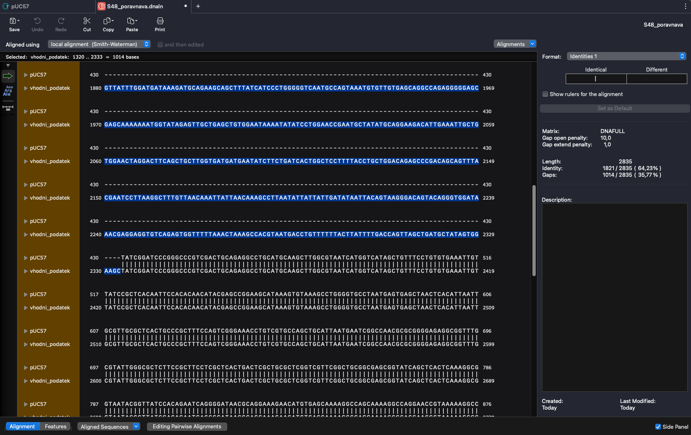
### 2. Iskanje z proteina
#### Blastx
Najprej sem sem želel najti svoj protein Z BlastX. Svoje zaporedje sem iskal med metagenomskimi proteini in našel zadetek s 100% identičnostjo (naslednji zadetek je imel le 35% identičnost). Gre za dihidrofolat/folipoliglutamat sintazo COG0285, bakterijski encim, najden s sekvenciranjem ekološkega metagenoma (vzorca vode iz kontaminiranega jarka), ki spada v superdružino cl33827 ([KUG02934.1](https://www.ncbi.nlm.nih.gov/protein/KUG02934.1?report=genbank&log$=prottop&blast_rank=1&RID=587EN9DT013)). V članku piše, da so protein določili s homologno primerjavo, zato dejanska struktura ne obstaja in bom moral iskati po podobnih proteinih. Da bi podobne proteine našel v uniprot-u ali pa pdb, sem uporabil blastP
#### Blastp 
Rezultat svojega iskanja z blastx, KUG02934.1, velik 401 ak, sem v FASTA formatu prilepil v blastp in iskal po neredundančni zbirki. Iskanje je vrnilo veliko podobnih rezultatov. Po anaizi rezultatov se je izkazalo da so vsi tudi, ali brez strukture, ali pa je struktura določena z alphafold. Za nadaljevanje sem si izbral prvega z e=0 in 68% identičnostjo: [NLL86595.1](https://www.ncbi.nlm.nih.gov/protein/NLL86595.1?report=genbank&log$=protalign&blast_rank=1&RID=588FACCN013).

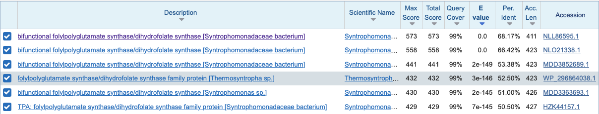

Da sem se prepričal, ali lahko res ti dve strukturi med seboj primerjam, sem izvedel dot matcher poravnavo:

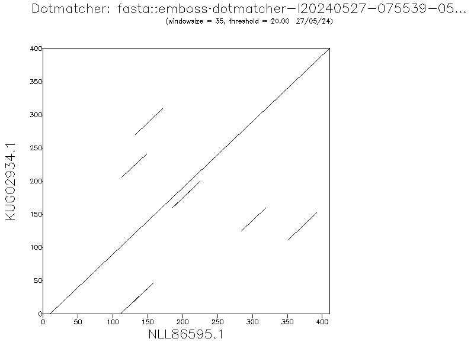

Z odlično globalno poravnavo sem dokazal, da je smiselno strukturo svojega proteina primerjati s strukturo najdenega proteina z blastp.

Da bi našel morda **bolj zanesljiv vir za določanje strukturinih parametrov**, sem šel na uniprot, poiskal vse dihidrofolat sintaze katerih struktura je eksperimentalno določena, velikost pa je med 350 in 450 AK (v tem velikostnem razredu so bili ti encimi pri bakterijah z blastp iskanjem). Dobil sem 10 zadetkov in jih poravnal s svojim 401 ak dolgim proteinom.

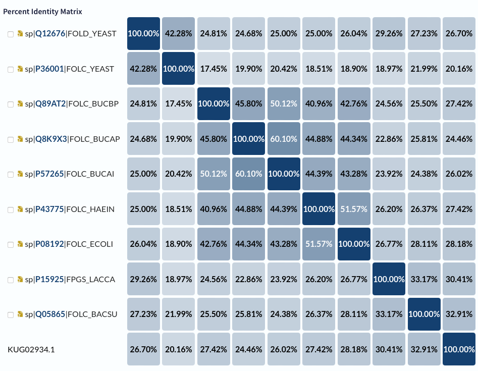

Iz rezultatov sklepam, da je moj protein najbolje primerjati s proteinom [Q05865](https://www.uniprot.org/uniprotkb/Q05865), za to sem izvedel še eno dotmatcher poravnavo: 

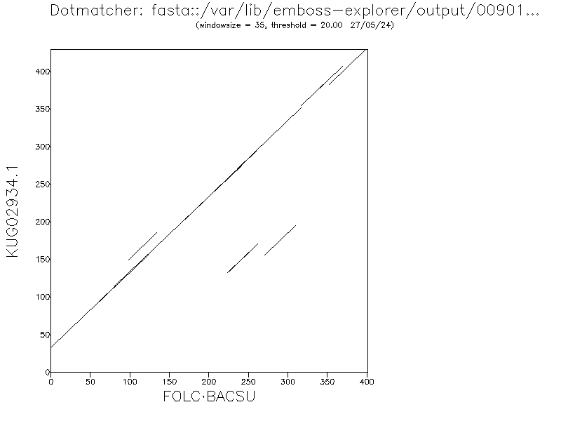

Rezultati ponovno kažejo na izjemno globalno poravnavo.

### 3. Priprava modela AlphaFold3
Ker moj protein ni bil eksperimentalno določen, niti na uniprotu ni AlphaFold modela, je bilo model predvideti. Predikcija je bil narejena z AlphaFold3 serverjem, pri čemer je bila zanesljivost zelo visoka, vrednost pTM pa 0.96. 
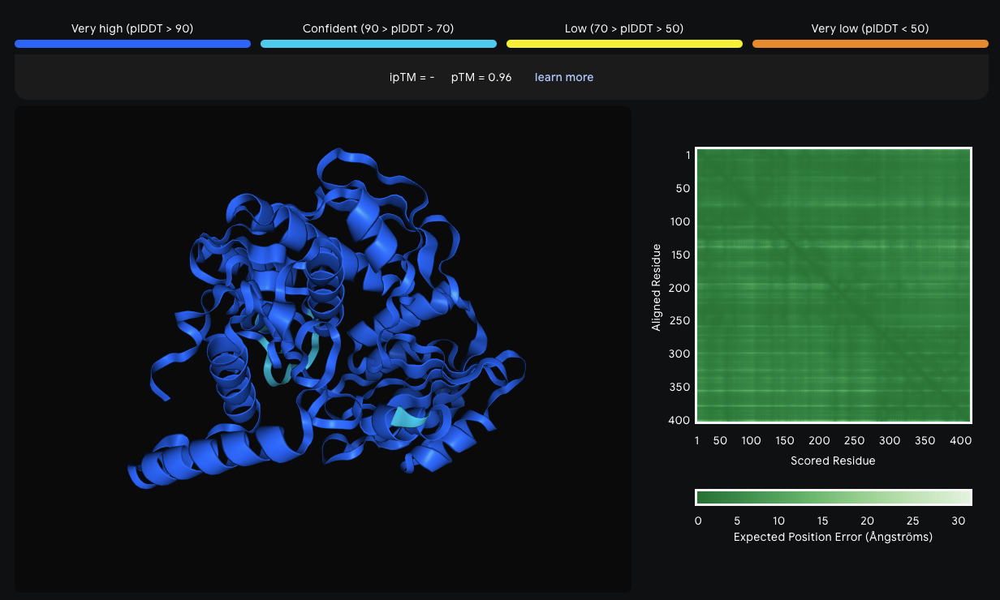
### 4. Analiza proteina
Analiza strukture proteina temelji na  analizi strukture pripravljene z modelom AlphaFold3 v kombinaciji z analizo pregledane strukture podobnega proteina Q05865. 
1. Funkcija:
Kot že omenjeno, gre za encim dihidrofolat sintazo (ligazo), ki katalizira naslednjo reakcijo: 
$$ATP + 7,8dihydropteroate + Lglutamate \rightleftharpoons ADP + phosphate + 7,8dihydropteroylglutamate$$
2. Lokalizacija: gre za citoplazemski protein
3. Zgradba: s primerjavo označenega modela in svojega AlphFold modela sem poiskal aktivna/vezavna mesta, domene ipd.
* Aktivna/vezavna mesta: (*iz slike je dodatno vidna dobra globalna poravnava*)
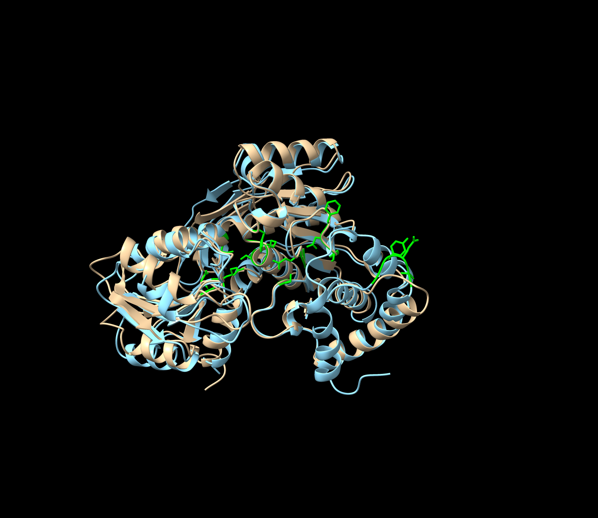
    * ATP: Lys19-Ser21, Gln229, Arg267, Asp280
    * Mg2+: Ser42, Ile110 (substitucija za Glu145 pri označenem), His138 
    * 7,8-dihidropteroat (substrat): tukaj je del vezavnega mesta slabše ohranjen in zamaknjen za 2-3 ak ostanke: Glu84-His85. Tyr118-Ser120 (*na spodnji sliki*) deluje ohranjen z samo eno podobno substitucijo.
    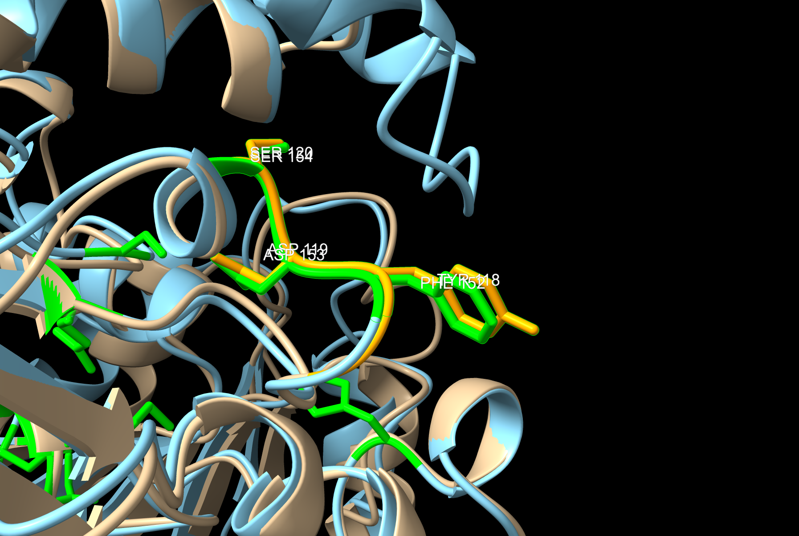 
* Domene: označeni sta dve signifikantni domeni, glutamat-ligaza domena (240-342)(vijolično) in srednja domena (13-240)(modro).
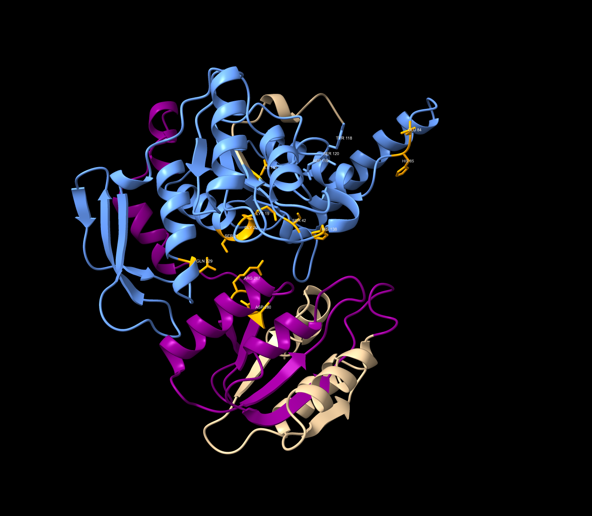 
* PTM: nisem našel informacij o PTM, za to sem se odločil poiskati morebitne disulfidne mostičke. Poiskal sem vse cisteine, nato pa izbral le tri najbližje in izmeril razdaljo med njihovimi žveplovimi atomi. Te razdalje so bile večje od 3A, ki je "cut-off" razdalja za disulfidno vez tako da sklepam, da v proteinu ni znanih PTM. 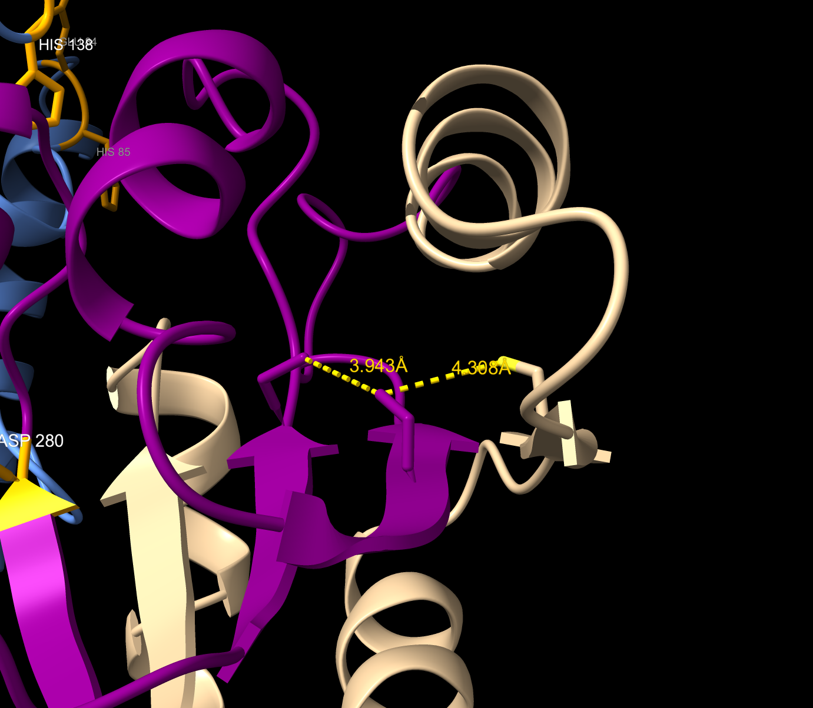 
* Podobni proteini
Z blastp sem poiskal podobne proteini in naredil filogenetsko drevo. Pri iskanju nisem našel ničesar drugega kot točno ta tip encima, za to sklepam, da **ni funkcijsko povezanih proteinov**.
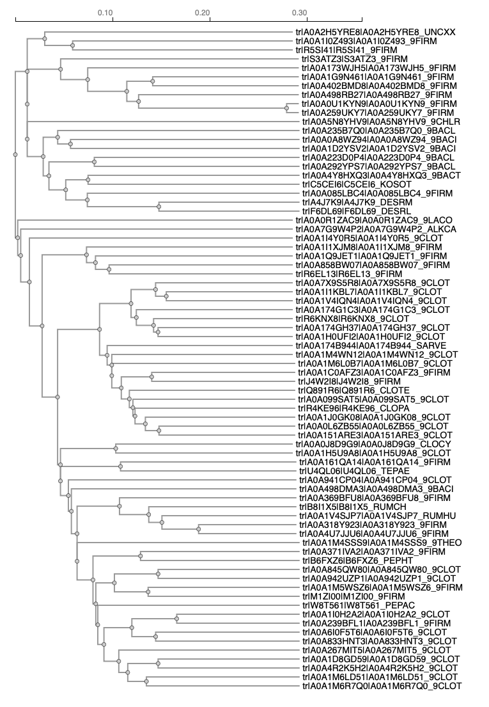 
* Podobni evkariontski proteini: 
V Uniprotu sem našel mišjo in človeško verzijo encima, kateri sta pokazali identičnost le okoli 17-18%. Podobnost je zelo lokalna, največja je med AK ostanki 80 in 120, to je območje srednje domene in vsebuje tudi vezavna mesta, torej lahko sklepamo, da je ta del proteina dobro ohranjen.