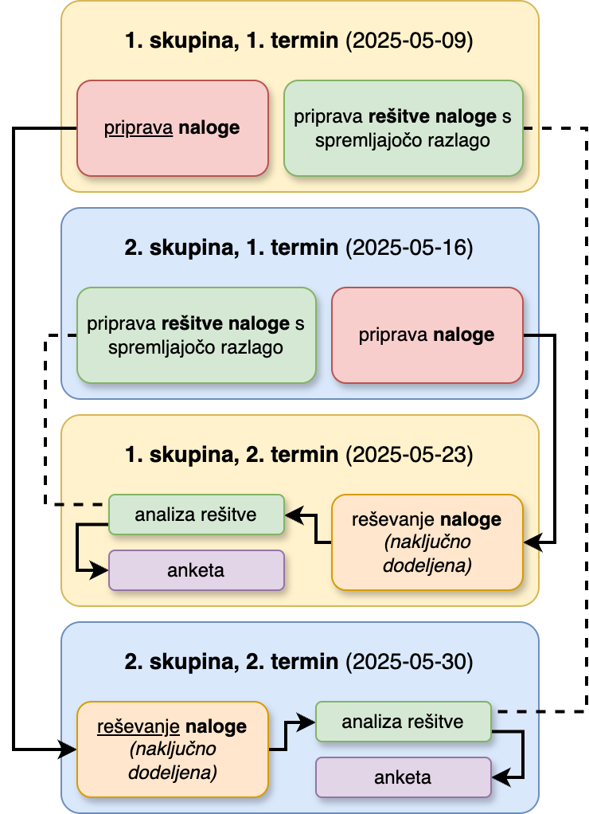

# Seminar 2024/2025

## Skupine in termini

Seminar se izvaja v dveh skupinah:

| Skupina | 1. termin               | 2. termin               |
|:--------|:------------------------|:------------------------|
| 1       | 2024-05-09 (8.00–11.00) | 2024-05-23 (8.00–11.00) |
| 2       | 2024-05-16 (8.00–11.00) | 2024-05-30 (8.00–11.00) |

V vsaki skupini ste razporejeni v pare in tako tudi izvajate seminarsko nalogo. V pare se porazdelite sami po lastni želji na prvem od obeh terminov.

Poimenska razporeditev v skupini je objavljena v spletni učilnici UL FKKT pod predmetom Biokemijska informatika.

---
## Splošne informacije

Vaša naloga oz. naloga posameznega para je, da **pripravi nalogo s področja biokemijske informatike** *ob upoštevanju na vajah in predavanjih obravnavane snovi* (torej ne nujno zgolj na vajah obravnavane snovi!) ter **spremljajočo rešitev te naloge z razlago** (v ločeni datoteki). Naloge, ki jih boste ustvarili pari iz ene skupine, bodo naključno dodeljene parom iz druge skupine (in obratno), ki jih bodo morali rešiti, nato primerjati svojo rešitev z dokumentirano rešitvijo avtorjev naloge, svoje mnenje pa bodo posredovali preko spletne ankete (povezava do ankete bo dodana kasneje).

Načrt izvedbe je grafično prikazan na spodnji shemi.

## Opravljen seminar in ocena

Da se bo seminar upošteval kot opravljen mora(ta) biti:
- vsak posameznik **prisoten** na obeh terminih ter **aktivno sodelovati** v paru pri pripravi naloge in rešitve,
- **naloga in rešitev pripravljeni v skladu z [navodili](#navodila)**.

Naloge se sicer ne bodo ocenjevale, **bodo pa avtorji do največ petih najboljših nalog (torej skupno 10 avtorjev) nagrajeni z dodatkom pri končni oceni predmeta in sicer v višini +5 %** (prišteje se h končni oceni, izračunani iz uspešno opravljenega kolokvija in izpita).

## Navodila za pripravo nalog in rešitev

Vaša naloga je torej sestavljena iz dveh delov:
1. **Zamislite si morate nalogo ter jo zapisati** na način, da bo reševalec(ka) dobil vse potrebne podatke zareševanje.
2. **Posebej pripravite rešitev te naloge in jo pospremite z razlago.**

### Koraki

1. Prenesite Markdown [datoteko s predlogo](https://mpavsic.github.io/biokeminfo/_sources/seminar/seminar_2024-2025/naloga-predloga.md) (desni klik -> shrani kot ...), jo ustrezno preimenujte (npr. `S01.md` pri čemer je `01` paru dodeljena številka), iz nje pobrišite komentarje in zapišite nalogo.
2. Pripravite Word datoteko, jo poimenujte kot `S01-resitev.docx` (to je primer imena, vezan na prejšnjo točko), v njej pa pripravite rešitev naloge, dodajte zaslonske slike ipd.
3. Po potrebi lahko pripravite še dodatne spremljevalne datoteke kot del rešitve, če je to potrebno (poimenujte jih po ključu `S01-resitev-vsebina.koncnica`, pri čemer besedo `vsebina` nadomestite s kratkim opisom, `koncnica` pa s končnico, npr. `pdb`).
3. Word datoteko shranite kot PDF, npr. `S01-resitev.pdf`.
4. Prepričajte se, da ste datoteke res ustrezno poimenovali.
5. Datoteke oddajte preko posebne povezave v spletni učilnici (razdelek 'Seminar'). Word datoteke ni potrebno oddajati, dovolj je PDF. **Datoteke morate oddati znotraj seminarskega termina.**

**V datoteko z nalogo ne zapisujte vaših imen!**

### Poimenovanje datotek

Na primer, par št. 5 bi lahko oddal naslednje datoteke:
- `S05.md` (obvezno),
- `S05-resitev.pdf` (obvezno),
- `S05-resitev-model.pdb`.

Pri poimenovanju datotek upoštevajte smernice, navedene [tukaj](../../priloge/datoteke_poimenovanje.md).

### Smernice

Pri **pripravi naloge** upoštevajte smernice:
- Naloga mora biti rešljiva.
- Naloga ne sme biti preveč enostavna, hkrati pa ne preobsežna ali prezahtevna – od povprečnega reševalca mora zahtevati približno 90 min časa.
- Potrudite se, da bo naloga čim bolj zanimiva. Lahko je recimo povezana s kakšnim člankom ali aktualnim problemom.
- Za idejo, kako zapisati zanimivo nalogo, malce pomislite na naloge, ki ste jih dobili na kolokviju. Seveda mora biti vaša naloga kompleksnejša.
- Naloga naj bo rešljiva z uporabo zbirk in orodij, dostopnih preko spleta (podobno kot na vajah).
- Če reševanje naloge zahteva uporabo programa, ki ga niste uporabljali na vajah (npr. orodje za identifikacijo genov v zaporedjih, identifikacija intronov, napoved neurejenih regij, ...), lahko na to namignite v nalogi.

Pri **pripravi rešitve** upoštevajte smernice:
- Jasno navedite vse korake, potrebne za rešitev naloge, ter jih razložite.
- Navedite morebitne alternativne rešitve in jih pokomentirajte.
- Vključite zaslonske slike, ko dokumentirajo proces reševanja ter vmesne in končne rezultate. Opremite jih s komentarji oz. naslovi, da bo jasno, kaj je na posamezni sliki prikazano. Prav tako se na slike naslavljajte v opisu postopa reševanja.
- Če je potrebna uporaba spletnega programa (ali zbirke), ki ga niste uporabljali na vajah, posebno pozornost namenite opisu tega programa (kako se uporablja, interpretacija rezultatov). Dodate lahko tudi povezave do spletne pomoči ipd.