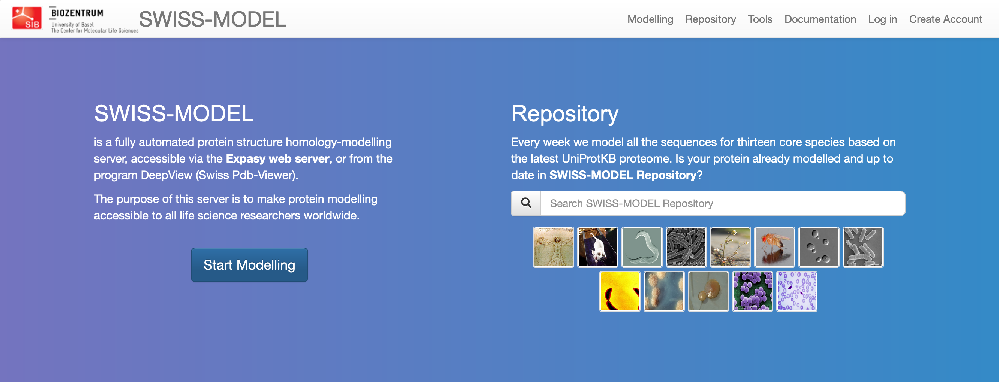
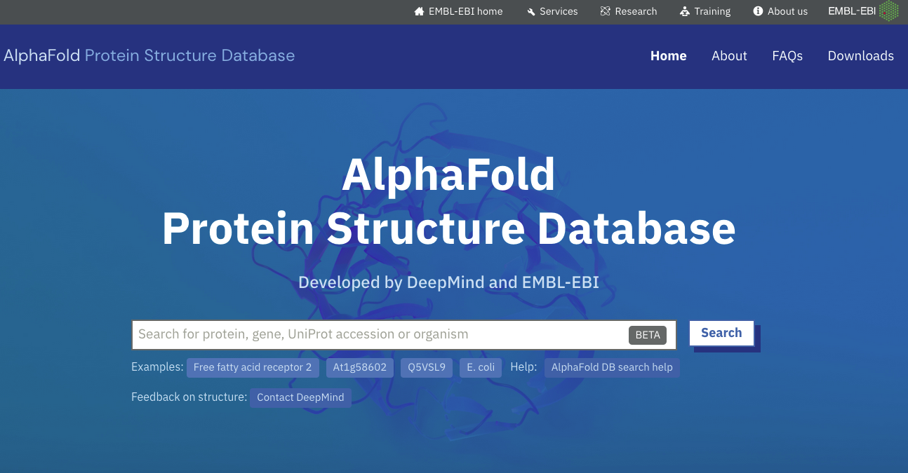

# VAJA: Modeliranje na osnovi homologije

Pri modeliranju struktur proteinov lahko uporabljamo različne pristope. Nekaj let nazaj so dali najboljše rezultate v smislu pravilnosti (podobnosti eksperimentalni strukturi) pristopi na osnovi homologije, sploh če je bila med aminokislinskima zaporedjema tarče in znane eksperimentalno določene strukture visoka identičnost. Najnovejši pristopi, ki temeljijo na umetni inteligenci (angl. artificial inteligence, AI), izračunajo danes za "lahke" tarče (zaporedja, pri katerih je identičnost aminokislinskega zaporedja z znano/znanimi eksperimentalno določenimi strukturami zelo visoka, hkrati pa poravnava pokriva celotno tarčno zaporedje ali vsaj veliko večino zaporedja) modele, ki so podobno zanesljivi kot modeli na osnovi homologije, za težje tarče pa so modeli, izračunani s pomočjo AI, neprimerno boljši.

Od orodij za modeliranje struktur proteinov se morda najpogosteje uporabljajo naslednja:
- [SWISS-MODEL](https://swissmodel.expasy.org/) za modeliranje na osnovi homologije, predvsem zaradi enostavnega vmesnika in hitrega izračuna modelov,
- [I-TASSER](https://zhanggroup.org/I-TASSER/), ki je pred prihodom orodij na osnovi AI bilo eno izmed boljših orodij za modeliranje na osnovi homologije ter ab initio modeliranje krajših segmentov,
- [Rosetta](https://www.rosettacommons.org/software), ki jo je treba z nekaj truda nainstalirati lokalno, dostopna pa je tudi preko strežnika [Robetta](https://robetta.bakerlab.org/), z AI podkrepljena varianta pa se imenuje [RoseTTAFold](https://github.com/RosettaCommons/RoseTTAFold) in je dosegljiva kot opcija na strežniku Robetta, ter
- [AlphaFold2](https://github.com/deepmind/alphafold), ki ga lahko poganjamo lokalno (bolje: na računski gruči) ali pa izkoristimo računsko infrastrukturo Google Colab - [ColabFold](https://github.com/sokrypton/ColabFold).

## SWISS-MODEL

Eno izmed uporabnikom zelo prijaznih in za uporabo preprostih orodij je [SWISS-MODEL](https://swissmodel.expasy.org/):

Interaktivno modeliranje zaženemo s pritiskom na gumb `Start Modelling`. Kot vhodni podatek vnesemo ak- zaporedje v formatu FASTA (ali kar UniProt kodo zapisa), eventuelno lahko "projektu" določimo ime in opcijsko vpišemo še e-poštni naslov (v primeru, da modeliranje traja dlje in nas o rezultatih obvesti prek e-pošte). Na voljo imamo iskanje po predlogah (`Search For Templates`), kjer nam predlaga eno ali več možnih struktur kot predloge (izberemo eno ali več, za vsako nam naredi ločen model), ali pa kar kliknemo `Build Model`, kjer program sam izbere zanj najbolj smiselno predlogo in izračuna en model.

Podrobnosti in navodila so opisana v [dokumentaciji](https://swissmodel.expasy.org/docs/help).

## AlphaFold2

Najlažji način za poganjanje AlphaFold2 je v obliki ColabFold iPython zvezka v storitvi Google Colab, kar je opisano v posebnem [članku](https://doi.org/10.1038/s41592-022-01488-1), zvezki za različne variante ColabFold pa so dostopni na repozitoriju [ColabFold na GitHub](https://github.com/sokrypton/ColabFold). Osnovne variante, ki so na voljo, so:
- [AlphaFold2_mmseq2](https://colab.research.google.com/github/sokrypton/ColabFold/blob/main/AlphaFold2.ipynb), ki za izračun poravnav uporablja MMseqs2 in HHsearch (hitreje kot Jackhammer),
- [AlphaFold_batch](https://colab.research.google.com/github/sokrypton/ColabFold/blob/main/batch/AlphaFold2_batch.ipynb), ki prav tako uporablja MMseqs2, zvezek pa je prilagojen za pošiljanje več tarčnih zaporedij hkrati,
- [AlphaFold2](https://colab.research.google.com/github/deepmind/alphafold/blob/main/notebooks/AlphaFold.ipynb), ki za izračun poravnav uporablja Jackhammer, gre pa za varianto od DeepMind (Google).

Navodila za ColabFold so dostopna na dnu iPython zvezka, uporaba pa je nazorno prikazana tudi na relativno dolgem [videoposnetku na Youtube](https://www.youtube.com/watch?v=Rfw7thgGTwI).

Na kratko, enostavno modeliranje monomernega proteina lahko z [AlphaFold2_mmseq2](https://colab.research.google.com/github/sokrypton/ColabFold/blob/main/AlphaFold2.ipynb) izvedemo tako:
1. V polje `query_sequence` vnesemo aminokislinsko zaporedje.
2. Kot `jobname` nastavimo poljubno ime (uporabimo ime proteina, pri dolžini in uporabljenih znakih je dobra razumnost.)
3. Pri `num_relax` izberite, koliko končnih modelov želite energijsko minimizirati (relaksirati) z uporabo Amber. Za enostavne primere to kar pustite na 0, saj simulacija molekulske dinamike traja kar precej časa.
4. Pri `template_mode` izberite, ali bo AlphaFold2 poizkusil najti v zbirki PDB (dejansko gre za reducirano obliko pdb70, prag identičnosti 70 %) strukture s podobnim ak zaporedjem. To lahko tudi izključite (pri računu se upošteva samo stike med ak ostanki na osnovi analize poravnav), lahko pa naložite svojo predlogo (v formatu mmCIF).
5. Ostale nastavitve so še glede MSA (katera zaporedja vzamemo in pa tvorba parov zaporedij, slednje je pomembno za modeliranje kompleksov pri čemer se združujejo zaporedja v pare le, če so vsa iskalna zaporedja (za vse verige kompleksa) prisotna v določeni taksonomski enoti).
6. Za modeliranje monomernega proteina pustimo `model_type` na *auto*, prav tako število ciklov recikliranja.
7. Priporočljivo je vključiti, da se rezultati na koncu zapakirajo v datoteko zip in naložijo v Google Drive (`save_to_google_drive`).
8. Zaženemo vse celice (najlažje preko Runtime > Run all).

Pozor:
- Ne pretiravajte z velikostjo proteina, saj bo sicer na vam dodeljenem računskem viru na Google Colab zmanjkalo spomina in se bo modeliranje avtomatsko prekinilo.
- Zavihka v brskalniku, kjer teče AlphaFold2, ne zapirajte, saj je pri brezplačnem računu obvezna uporaba interaktivnega načina. Lahko se zgodi, da se bo med modeliranjem pojavilo tudi pozivno okno, ki bo od vas zahtevalo interakcijo (preverjanje vaše prisotnosti).

Da bi bili modeli, izračunani z AlphaFold2, dostopni čim širši javnosti, so v EBI pripravili podatkovno zbirko vnaprej izračunanih modelov številnih proteinov, dne 2023-04-18 je šlo za modele več kot 200 milijonov proteinov. Med drugim gre za celoten človeški proteom ter proteome nekaterih modelnih organizmov, vsi  modeli pa so dostopni preko posebne spletne strani [AlphaFold DB](https://alphafold.ebi.ac.uk/), povezave do modelov pa so dodane tudi v kategorijo *Structure* v zbirki [UniProt](https://www.uniprot.org/).

Modele si lahko na Strani UniProt oz. v podatkovni zbirki na EBI ogledamo kot 3D modele, pobarvane glede na zanesljivost napovedi strukture (pLDDT, *per-residue confidence score*, v razponu od 0 do 100). Pri regijah z nizko pLDDT gre pogosto za strukturno neurejene regije.

---

## Naloga 1
Zanima nas struktura celotnega človeškega klavdina-7 (claudin-7). Poiščite strukturo/model oz. ga sami pripravite ter ga analizirajte v smislu realnosti.

Potek reševanja:
1. Glavne značilnosti človeškega klavdina-7 si oglejte v zbirki UniProt. Je morda v tej bazi povezava na že pripravljen model in če je, je ta model zadovoljiv? Kako bi lahko pripravili boljši model?
2. Pripravite model omenjenega proteina s programom [SWISS-MODEL](http://swissmodel.expasy.org/), model z [I-TASSER](http://zhanglab.ccmb.med.umich.edu/I-TASSER/) pa je že pripravljen (za ta program se je potrebno registrirati, izračun pa traja kak dan) in sicer:
   * rezultati modeliranja s privzetimi nastavitvami (kot vhodni podatek je bilo dano ak-zaporedje klavdina-7) so zbrani v datotekah:
      * posamezni modeli: [model1](https://github.com/mpavsic/biokeminfo/blob/main/biokeminfo/vaje/izhod/ITASSER-CLDN7_HUMAN_default-model1.pdb), [model2](https://github.com/mpavsic/biokeminfo/blob/main/biokeminfo/vaje/izhod/ITASSER-CLDN7_HUMAN_default-model2.pdb), [model3](https://github.com/mpavsic/biokeminfo/blob/main/biokeminfo/vaje/izhod/ITASSER-CLDN7_HUMAN_default-model3.pdb), [model4](https://github.com/mpavsic/biokeminfo/blob/main/biokeminfo/vaje/izhod/ITASSER-CLDN7_HUMAN_default-model4.pdb) in [model5](https://github.com/mpavsic/biokeminfo/blob/main/biokeminfo/vaje/izhod/ITASSER-CLDN7_HUMAN_default-model5.pdb)
      * [izpis strani](https://github.com/mpavsic/biokeminfo/blob/main/biokeminfo/vaje/izhod/ITASSER-CLDN7_HUMAN_default-log.pdf) z rezultati modeliranja v formatu PDF
      * celoten izhod: [ITASSER-CLDN7_HUMAN_default.zip](https://github.com/mpavsic/biokeminfo/blob/main/biokeminfo/vaje/izhod/ITASSER-CLDN7_HUMAN_default.zip)
   * rezultati modeliranja, pri katerem eksplicitno NISO bile upoštevane strukture s PDB kodami 4p79 in 3x29 je v datoteki I-TASSER-hCldn7_excluded_4p79_3x29.zip (te strukture so v času priprave modela bile edine, ki so predstavljale smiselne predloge za strukturo, danes je to nekoliko drugače, saj je struktur več):
      * posamezni modeli: [model1](https://github.com/mpavsic/biokeminfo/blob/main/biokeminfo/vaje/izhod/I-TASSER-hCldn7_excluded_4p79_3x29-model1.pdb), [model2](https://github.com/mpavsic/biokeminfo/blob/main/biokeminfo/vaje/izhod/I-TASSER-hCldn7_excluded_4p79_3x29-model2.pdb), [model3](https://github.com/mpavsic/biokeminfo/blob/main/biokeminfo/vaje/izhod/I-TASSER-hCldn7_excluded_4p79_3x29-model3.pdb), [model4](https://github.com/mpavsic/biokeminfo/blob/main/biokeminfo/vaje/izhod/I-TASSER-hCldn7_excluded_4p79_3x29-model4.pdb) in [model5](https://github.com/mpavsic/biokeminfo/blob/main/biokeminfo/vaje/izhod/I-TASSER-hCldn7_excluded_4p79_3x29-model5.pdb)
      * [izpis strani](https://github.com/mpavsic/biokeminfo/blob/main/biokeminfo/vaje/izhod/I-TASSER-hCldn7_excluded_4p79_3x29.pdf) z rezultati modeliranja v formatu PDF
      * celoten izhod: [I-TASSER-hCldn7_excluded_4p79_3x29.zip](https://github.com/mpavsic/biokeminfo/blob/main/biokeminfo/vaje/izhod/I-TASSER-hCldn7_excluded_4p79_3x29.zip)
3. Poiščite tudi model tega proteina, izračunanega z AlphaFold2.
4.  Najboljše modele, dobljene iz posameznih orodij, primerjajte med seboj in s strukturo, uporabljeno kot predlogo za modeliranje na osnovi homologije (superpozicija v UCSF Chimera), prav tako pa jih ocenite v smislu “realnosti” (so modeli v skladu s pričakovanju na osnovi zapisa v zbirki UniProt?).

## Naloga 2
Vsak si naj izbere en protein (priporočam, da izberete bolj "eksotične" proteine ali pa proteine iz "eksotičnih" organizmov), za katerega:
1. z iskanjem po zbirki PDB preko programa BLAST preverite, ali je znana struktura točno tega proteina; če je znana struktura, ki pokriva večji del zaporedja izbranega proteina, si izberite drug protein;
2. izdelajte model s pomočjo programa SWISS-MODEL, in sicer za celotni protein (seveda odstranite morebitni signalni peptid in/ali proregije);
3. model, ki ga izračunate, in pa strukturo, uporabljeno kot predlogo, naložite v program UCSF Chimera in primerjajte preko superpozicije (*MatchMaker*).

Odgovorite na vprašanja:
1. Ali model pokriva celotno ak zaporedje, ki ste ga uporabili? Zakaj da oz. ne?
2. So med modelom in uporabljeno predlogo v katerih regijah večje razlike? Katerimi? Zakaj?
3. Kako je z zanesljivostjo modela vzdolž aminokislinskega zaporedja?
4. Bi lahko model kako izboljšali? Kako?
