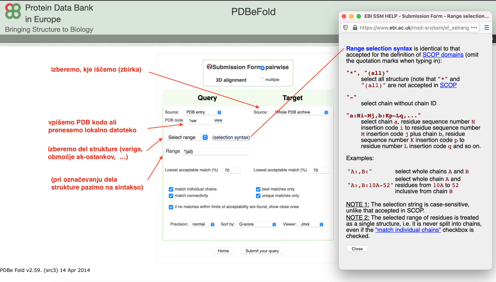

# VAJA: Iskanje podobnih struktur

Na primeru si bomo ogledali, kako lahko proteine s podobno strukturo identificiramo z iskanjem z uporabo BLAST (uporabimo aminokislinsko zaporedje proteina, za katerega želimo najdi podobne strukture) ter tudi direktno z iskanjem podobnih struktur.

## Uvod
Če kot **vhodni podatek uporabimo aminokislinsko zaporedje** proteina (ali njegovega dela), za katerega želimo najti podobne strukture oz. identificirati podobne proteine z znano strukturo izhajamo iz dejstva, da na podobno strukturo/zvitje kaže podobno aminokislinsko zaporedje kaže. Iskanje izvedemo z različico *blastp* programa BLAST (seveda lahko izvedemo tudi iskanje s *psi-blast*), pri tem pa kot zbirko za iskanje izberemo `Protein Data Bank proteins(pdb)`:

Drug način iskanja je da kot **vhodni podatek uporabimo strukturo** sámo. Na voljo je več orodij, ki tako iskanje omogočajo, na primer [PDBeFold](https://www.ebi.ac.uk/msd-srv/ssm/) (iskanje prek ujemanja elementov sekundarne strukture) in [DALI](http://ekhidna2.biocenter.helsinki.fi/dali/) (uporaba matrik razdalj med ak-ostanki).

Pri iskanju s [PDBeFold](https://www.ebi.ac.uk/msd-srv/ssm/) lahko kot iskanje uporabimo datoteko s strukturo, ki jo prenesemo na strežnik, ali pa uporabimo strukturo iz zbirke PDB. Pri tem se lahko pri iskanju podobnih struktur omejimo na nek segment strukture (veriga, območje ak-ostankov):

[PDBeFold](https://www.ebi.ac.uk/msd-srv/ssm/) prikaže rezultate v obliki tabele, ki je provzeto sortirana po padajoči vrednosti Q. Slednja predstavlja funkcijo kvalitete poravnave atomov C$_{\alpha}$, ki vključuje tako dolžino poravnave kot tudi RMSD. Na splošno so dobre poravnave take, ki imajo nizek RMSD ter visoko število poravnanih ak-ostankov. Izračuna se po formuli:

$$
Q = \frac{N_{poravnano}^2}{(1+\frac{RMSD}{R_0}^2 N_1 N_2)}
$$

kjer je $R_0$ empirično določen parameter (3 Å), $N_1$ ter $N_2$ predstavljata število ak-osnatkov v poravnanih proteinih, $N_{poravnano}$ pa predstavlja število poravnanih ak-ostankov. Za identične strukture je Q enak 1.

V tabeli je še več drugih parametrov, do njihovega opisa pridete s klikom na ime stolpca v tabeli.

## Naloga
Zanima nas, kateremu drugemu proteinu z znano strukturo je podobna C-končna zunajcelična domena  človeškega proteina EpCAM, ki ustreza aminokislinskim ostankom 139-265 (številčenje po UniProt). Iskanje izvedite na dva načina:
* z uporabo aminokislinskega zaporedja in
* z uporabo strukture tega dela molekule pri tem pa uporabite orodje [PDBeFold](https://www.ebi.ac.uk/msd-srv/ssm/)

Analizirajte rezultate, pripravite superpozicijo struktur v UCSF Chimera ter odgovorite na vprašanja:
* S katerim pristopom identificiramo več zadetkov in zakaj?
* Je zvitje tega dela EpCAM in identificiranih podobnih proteinov dejansko enako?
* Je EpCAM funkcijsko soroden identificiranim proteinom?