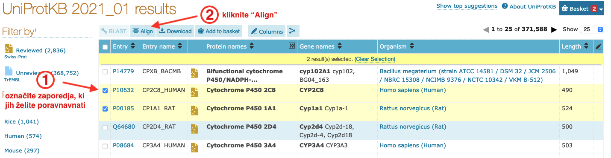

# VAJA: Poravnava zaporedij NW & SW (spletna orodja)

## Naloga 1

### Izbor načina poravnave
Kateri tip poravnave (globalna ali lokalna) je primernejša za primerjavo aminokislinskih zaporedij iz posameznega para?

* par A: izoobliki 1 in 2 človeške karbonske anhidraze
* par B: človeška proteina nidogen-2 in IGFBP-1 (*Insulin Growth Factor-Like Binding Protein 1*)
* par C: človeški fibronektin in podenota beta mišjega receptorja za interleukin 6
* par D: človeške neutrofilske elastaze in in duodenaze-1 (*duodenase-1*) iz zelene morske želve (*Chelonia mydas*)
* par E: človeški histon H3.1 in inhibitor ID-2 DNA-vezavnega proteina (*DNA-binding protein inhibitor ID-2*) iz sumatranskega orangutana (*Pongo abelii*)

Namig: zaporedja omenjenih proteinov poiščite v zbirki [UniProt](http://uniprot.org), oglejte si pripise. Proteine lahko analizate tudi preko spletne strani [InterPro](https://www.ebi.ac.uk/interpro/).

### Primerjava poravnav
Za para B in C (ločeno, seveda) izračunajte poravnavo na dva načina:
* globalna poravnava (algoritem Needleman-Wunsch oz. Needle (EMBOSS)) in
* lokalna poravnava (algoritem Smith-Waterman oz. Water (EMBOSS)).

Uporabili bomo program, ki teče na strežniku EBI (The European Bioinformatics Institute) in je del programskega paketa EMBOSS (European Molecular Biology Open Software Suite), dostopen pa je preko strani za poravnavo parov zaporedij [Pairwise Sequence Alignment – PSA](http://www.ebi.ac.uk/Tools/psa/).

Zaporedja vstavite v formatu FASTA vključno z imenom zaporedja, da boste vedeli, katero zaporedje je katero. Ime naj bo smiselno kratko, npr. za človeško elastazo ELAhum (take akronime je smiselno uporabljati na splošno pri poravnavah, saj se v njih skriva tako ime proteina kot tudi ime organizma). 

Razmislite in odgovorite:
* Primerjajte rezultat globalne in lokalne poravnave. Zakaj sta takšna, kot sta?
* Je rezultat poravnave v skladu s pričakovanji? Predvsem se osredotočite na značilnosti poravnane domene, kar lahko razberete iz zbirke Prosite.
* Kako nastavitve parametrov vplivajo na končen rezultat (poravnavo)?

## Naloga 2
Kateri aminokislinski ostanek (enočrkovna koda in zaporedna številka) bi morali zmutirati v konjski triptazi, da bi zagotovo ukinili aktivnost tega encima, hkrati pa ne bi bistveno posegli v stabilnost/strukturo encima?

**Namig za reševanje**: poravnavo lahko naredite kar v UniProt, pri čemer izberete zaporedja, ki jih želite poravnati, in kliknete na gumb `Align` (zaslonska slika spodaj). Orodje, ki izdela poravnavo, je sicer orodje za poravnavo večih zaporedij (Clustal Omega), a je seveda sposobno poravnati zgolj dve zaporedji.

