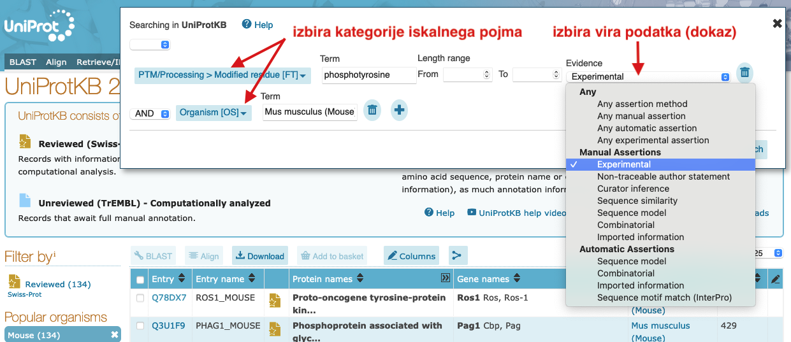

# VAJA: Dostop do UniProt v brskalniku

## Uvod
Na spodnjih primerih si bomo ogledali, kako iščemo po zbirki UniProt ter kakšne podatke lahko iz zapisov pridobimo. Za iskanje uporabite enostavni ali napredni iskalni vmesnik na strani [UniProtKB](http://www.uniprot.org), pri razumevanju zapisa pa si lahko pomagate z navodili na [posebni podstrani](http://www.uniprot.org/docs/manual) na UniProt.

### Napredno iskanje
Iskanje z naprednim vmesnikom je v osnovi podobno, kot smo to videli na primeru Entrez (NCBI). Na voljo je kopica kategorij iskalnih pojmov, ki lahko vključujejo tudi funkcijo proteina in druge pripise, pri teh pa lahko izbiramo, kako je bil nek podatek v zapisu pridobljen (npr. eksperimentalni dokaz, sklepanje na osnovi podobnosti) ter ali je bil zapis pregledan ročno (*manual assertion*). Kot primer je spodaj prikazano iskanje mišjih proteinov, ki imajo fosforiliran tirozinski ostanek, fosforilacija pa je bila eksperimentalno potrjena.

### Tabela z rezultati
Rezultati iskanja so prikazani v obliki tabele. Slednjo si lahko prilagodimo, enega ali več zadetkov (zapisov) pa si lahko prenesemo v različnih formatih. Kje so relevantne povezave na te funkcije je prikazano na spodnji sliki.

---
## Naloga 1
Ta naloga je enostavna – z analizo ustreznih zapisov v zbirki UniProt odgovorite na naslednja vprašanja:
1. Koliko transmembranskih regij vsebuje človeški E-kadherin?
2. Koliko disulfidnih vezi vsebuje zunajcelični del človeškega proteina EpCAM?
3. Kje v celici oz. izven nje se nahaja človeški katenin alfa-2? Možnih je več odgovorov.
4. Koliko cisteinskih aminokislinskih ostankov ene polipeptidne verige proteina mirakulina iz organizma *Synsepalum dulcificum* je oksidiranih?
5. Poiščite vse človeške proteine, ki so lipidirani (to je post-translacijska modifikacija (PTM), kjer je nanje kovalentno pritrjena lipidna veriga), ta modifikacija pa je eksperimentalno potrjena.

---
## Naloga 2
Ta naloga je nekoliko kompleksnejša in ilustrira, kako bi UniProt uporabili v realnem "laboratorijskem" primeru.

### Ozadje
Delamo na projektu na temo proteolitskega procesiranja proteinov na celični površini. Posebej nas zanima en encim, ki pri tem sodeluje, in sicer *Disintegrin and metalloproteinase domain-containing protein 28*, ki ga  kodira človeški gen *ADAM28*. Da bi ta encim lahko podrobneje proučili, smo si zamislili kup eksperimentov *in vitro*, za katere pa potrebujemo encim v čisti obliki.

### Vprašanja

Želimo omenjeni encim v rekombinantni obliki, in sicer kot topen aktiven protein. Odgovorite na naslednja vprašanja, ki se nanašajo na njegovo pripravo.

1. Katere ione moramo imeti v raztopini pri encimskih testih, da bo encim sploh aktiven?
2. Kateri del polipeptidne verige (od ... do ... ak-ostanka) moramo pripraviti, da bo encim aktiven in topen?
3. Če želimo imeti katalitsko neaktivno mutanto, kako to najenostavneje dosežemo?
4. Kateri ekspresijski sistem je primernejši za izražanje oblike iz 2. točke – bakterijski sistem ali insektne celice?
5. Recimo, da je oblika iz 2. točke stabilna pri pH = 8. Kakšen tip ionskega izmenjevalca (kationski, anionski) moramo izbrati, da se bo med čiščenjem z ionsko-izmenjevalno kromatografijo pri tem pH topen rekombinantni protein nanj vezal? Namig: uporabite spletno orodje [ProtParam](https://web.expasy.org/protparam/), ki vam na osnovi danega aminokislinskega zaporedja izračuna različne parametre, vključno s pI.

